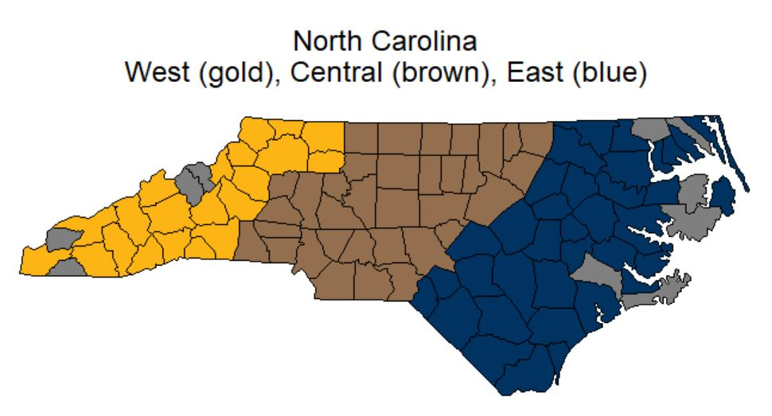
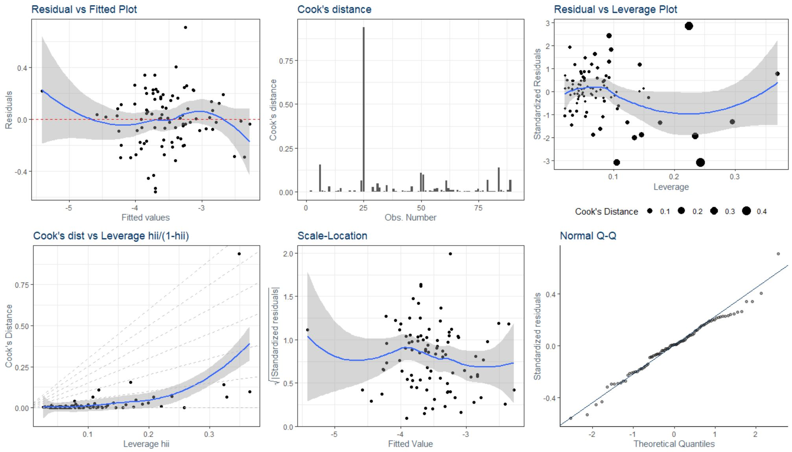
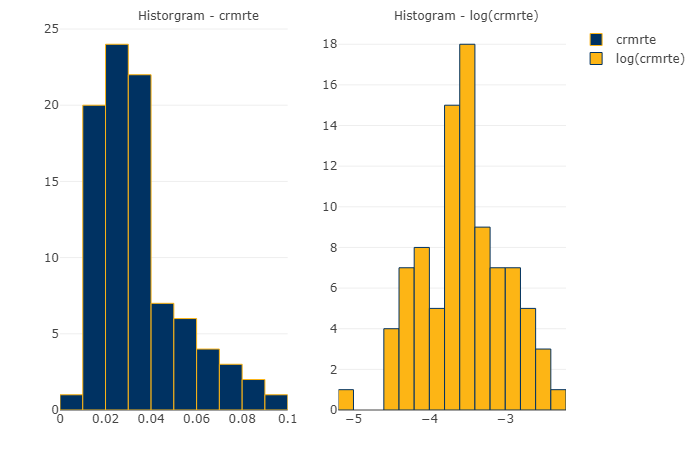

# Crime Statistics Analysis

> Determinants of Crime in North Carolina Counties (1987)


**Team:** [Cristopher Benge](https://cbenge509.github.io/) | [Joy First](mailto:jfirst@berkeley.edu) | [Kevin Kory](mailto:knkory92@berkeley.edu)

UC Berkeley, Master of Information and Data Science | Fall 2019
W203: Statistics for Data Science | G. Kleeman, PhD

---

## Overview

This study applies OLS regression to investigate the determinants of crime across 90 North Carolina counties using 1987 data. We develop three nested model specifications to evaluate the effects of deterrence (arrest and conviction rates), economic conditions (wages, tax revenue), and demographics on county-level crime rates. Our analysis yields actionable policy recommendations while carefully addressing model assumptions and limitations.

**[Read the Full Report (PDF)](Crime%20Analysis%20&%20Policy%20Recommendations.pdf)**

---

## Key Findings

| Finding | Effect | Policy Implication |
|:--------|:-------|:-------------------|
| **Arrest probability** | 1% increase → 0.04% decrease in crime rate | Invest in investigation and clearance rates |
| **Conviction probability** | 1% increase → 0.04% decrease in crime rate | Support prosecutorial capacity |
| **Police per capita** | Positive correlation (endogeneity concern) | More police deployed where crime already high |
| **Construction wages** | Higher wages → lower crime | Economic opportunity reduces crime |
| **Young male population** | Higher % → higher crime | Target prevention programs to at-risk demographics |

### Recommended Model

**Model 2** balances explanatory power with parsimony:

```
crmrte ~ prbarr + prbconv + log(polpc) + taxpc + wcon + pctymle + log(pctmin80)
```

- **Adjusted R²:** ~0.44
- **F-statistic:** Significant (p < 0.001)
- Passes heteroscedasticity tests
- Residuals approximately normal

*Model 1 omits important demographic controls; Model 3 risks overfitting with limited observations.*

---

## Data

<details>
<summary><strong>Click to expand data documentation</strong></summary>

### Source & Context

County-level crime statistics from 90 North Carolina counties (1987), sourced from Cornwell and Trumbull (1994). The dataset captures law enforcement, economic, and demographic characteristics used to study crime determinants.

### Key Variables

| Variable | Description | Notes |
|:---------|:------------|:------|
| `crmrte` | Crimes committed per person | **Dependent variable** |
| `prbarr` | Probability of arrest | Ratio: arrests/offenses |
| `prbconv` | Probability of conviction | Ratio: convictions/arrests |
| `polpc` | Police per capita | Log-transformed in models |
| `taxpc` | Tax revenue per capita | Proxy for county resources |
| `wcon` | Weekly wage, construction | Economic opportunity measure |
| `pctymle` | % young males (15-24) | Demographic risk factor |
| `pctmin80` | % minority (1980 census) | Log-transformed in models |

### Data Cleaning

| Step | Action | Result |
|:-----|:-------|:-------|
| Missing values | Removed 6 rows with NA in `prbarr` or `prbconv` | 97 → 91 rows |
| Duplicates | Removed duplicate entry for county 193 | 91 → 90 rows |
| Type conversion | Converted `prbconv` from factor to numeric | — |

### Limitations

**IID Assumption Violation:** The 10 missing counties are the lowest-populated counties in North Carolina. This is not random missingness—the sample systematically excludes rural counties, potentially biasing estimates for policies targeting less populated areas.



*Counties in the dataset (shaded) vs. missing counties*

</details>

---

## Methodology

<details>
<summary><strong>Click to expand methodology details</strong></summary>

### Approach

We employ **Ordinary Least Squares (OLS) regression** with a nested model strategy: starting with core deterrence variables, then adding controls to test robustness and reduce omitted variable bias.

**Feature selection** used two complementary methods:
- Exhaustive subset selection via `leaps::regsubsets()`
- Stepwise regression using AIC criterion

### Model Specifications

| Model | Variables | Purpose |
|:------|:----------|:--------|
| **Model 1** | `prbarr`, `prbconv`, `log(polpc)`, `taxpc`, `wcon` | Core deterrence + economic factors |
| **Model 2** | Model 1 + `pctymle`, `log(pctmin80)` | Adds demographic controls |
| **Model 3** | Model 2 + `wser`, `wfed`, additional controls | Full specification (robustness check) |

### Diagnostics Summary

| Assumption | Test | Model 2 Result |
|:-----------|:-----|:---------------|
| Linearity | Residuals vs. Fitted | No systematic pattern |
| Normality | Q-Q Plot, Shapiro-Wilk | Approximately normal |
| Homoscedasticity | Breusch-Pagan | No significant heteroscedasticity |
| Multicollinearity | VIF | All VIF < 5 |



*Diagnostic plots for recommended Model 2*

</details>

---

## Repository Structure

<details>
<summary><strong>Click to expand file listing</strong></summary>

| File | Description |
|:-----|:------------|
| [`Crime Analysis & Policy Recommendations.pdf`](Crime%20Analysis%20&%20Policy%20Recommendations.pdf) | Final report |
| [`first_kory_benge-lab_3.Rmd`](first_kory_benge-lab_3.Rmd) | R Markdown analysis source |
| [`first_kory_benge-lab_3.tex`](first_kory_benge-lab_3.tex) | LaTeX report root file |
| [`EDA.ipynb`](EDA.ipynb) | Exploratory data analysis notebook |
| [`crime_v2.csv`](crime_v2.csv) | Source dataset |
| `chapters/` | LaTeX chapter files (`introduction.tex`, `eda.tex`, `analysis.tex`) |
| `images/` | Generated visualizations and plots |

</details>

---

## Reproduce the Analysis

```r
# Install dependencies
install.packages(c("tidyverse", "car", "lmtest", "leaps",
                   "stargazer", "corrplot", "gridExtra"))

# Render the analysis
rmarkdown::render("first_kory_benge-lab_3.Rmd")
```

To compile the LaTeX report:
```bash
pdflatex first_kory_benge-lab_3.tex
```

---

## Team

| | Name | Contact |
|:--|:-----|:--------|
| | Cristopher Benge | [Website](https://cbenge509.github.io/) |
| | Joy First | [Email](mailto:jfirst@berkeley.edu) |
| | Kevin Kory | [Email](mailto:knkory92@berkeley.edu) |

## License

This project is licensed under the MIT License - see [LICENSE.txt](LICENSE.txt) for details.

---

<p align="center">
  
  <br>
  <em>Distribution of crime rates across North Carolina counties</em>
</p>
